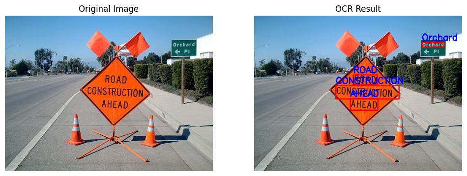

# 2조 '지휘' 조 미니프로젝트
김건휘, 정지민

README : https://github.com/chipmunk-tail/intel-mini-porject.git

# OCR + LLM을 이용한 이미지 텍스트 번역기
인텔 AISW 아카데미 인텔 미니 프로젝트

2025.03.12 ~ 2525.03.14


<br/>

## 개요
**OCR** + **LLM** 을 이용하여 이미지 속 언어를 한국어로 번역해서 이미지로 다시 출력해주는 미니 프로젝트

**OCR**
- 이미지 속 텍스트를 감지 후 텍스트로 반환

**LLM**
- OCR로 입력받은 텍스트를 LLM을 이용해 자연스럽게 번역

<br/>

## 목적

1. 이미지에서 텍스트를 추출
2. 추출한 텍스트를 LLM에 입력하여 번역
3. 번역된 텍스트를 다시 이미지 위에 출력 후 저장

<br/>

## 모델 선정

### OCR

**Keras-OCR**
- tensorflow keras 기반 딥러닝 OCR
- 네이버의 CRAFT 알고리즘을 사용
- CRNN 기반 모델


표지판의 모든 텍스트를 검출한 모습이다.

<br/>

**PaddleOCR**
- 중국 바이두에서 개발한 인공지능 OCR
- 여러 사이즈의 모델을 제공하며 테스트는 'samll' 모델로 진행



'orchard' 까지 검출하고 'pl'는 검출하지 못함

<br/>

**EasyOCR**
- pytorch 기반 CRNN 
- 네이버의 CRAFT 알고리즘을 사용


'orchard' 까지 검출하고 'pl'는 검출하지 못함

<br/>

OCR 모델은 Keras-OCR 모델을 선정하였다.

<br/>

### LLM

**T5 (Text-to-Text Transfer Transformer)**
- 트랜스포머를 기반으로 한 텍스트-투-텍스트 모델
- 번역, 요약, 질문 응답 등 여러 작업에 유용하게 사용
- 다양한 언어 쌍을 지원


번역이 이상하게 진행되었다.

<br/>

**Ollama + phi4**
- Ollama에서 'phi4:14b-q8_0' 양자화 모델을 구동
- 사용할 수 있는 자원 중 자연스러운 한국어를 출력하는 phi4 모델을 사용


속도가 느리지만 자연스럽게 한국어를 출력했다.

<br/>

## 시스템 구성도


### 구성 패키지

- **Keras-OCR**
  - 이미지에서 문자를 추출하는 OCR
  - CRNN 기반 딥러닝 모델
  - tensorflow keras 기반 모델

- **phi4**
  - Ollama에서 'phi4:14b-q8_0' 양자화 모델을 구동
  - API 형식으로 LLM 이용
  - 2개의 프로세스가 필요 (OCR 번역 코드 진행) + (Ollama 구동)


<br/>

## 시연


### 시연 방법

1. 필요한 패키지 설치
```
pip install tensorflow==2.10 keras-ocr ollama matplotlib opencv-python PIL re
```

<br/>

2. Ollama 설치 및 모델 로드
```
sudo apt update
curl -fsSL https://ollama.com/install.sh | sh

ollama pull phi4:14b-q8_0
```

<br/>

3. ollama 모델 실행
```
ollama run phi4:14b-q8_0
```
(실습에 사용된 작업환경은 i3 12100 + 24GB 메모리 + GTX 1660 super환경에서 실행되었음!)

<br/>

4. 'OCR+LLM.py 실행
새로운 터미널에서 해당 코드를 실행


<br/>

## 고찰 및 한계점

### OCR 모델이 한번에 다중언어를 지원하지 않음

keras OCR, PaddleOCR, EasyOCR 이 3개의 OCR 모델은 여러 언어를 지원하지만 언어는 하나밖에 선택을 못한다.
- 언어 선택을 'ko' 형식으로 해당 언어에 특화되어 학습된 모델을 선택할 수 있음

<br/>

### CV2의 한글 폰트 미지원


CV2 기본 폰트에서 한글을 지원하지 않아서 '?????' 형태로 출력

해당 문제는 폰트 파일을 추가함으로써 해결하였다.

<br/>

### 텍스트가 이미지 밖으로 잘려서 출력됨


```
OCR : danger
cause
may
damage
to
organs
phi4 : 위험  
원인으로 인하여  
기관에 손상을 줄 수 있습니다.
OCR: 'danger' at (77, 26) → 번역: '위험  '
OCR: 'cause' at (126, 306) → 번역: '원인으로 인하여  '
OCR: 'may' at (56, 307) → 번역: '기관에 손상을 줄 수 있습니다.'
```

OCR과 LLM을 통한 번역이 자연스럽게 진행되었지만 이미지에 텍스트를 삽입하는 과정에서 텍스트가 밖으로 나가는 문제점이 발생함

<br/>

### 자연스러운 문장을 위해 LLM을 사용했지만 결과가 다르게 나옴

**CASE_01**


터미널 결과창 : 
```
OCR : orchard
pl
road
construction
ahead
phi4 : 수풀 앞에 도로 건설이 있습니다.  

OCR: 'orchard' at (402, 65) → 번역: '수풀 앞에 도로 건설이 있습니다.'
```

LLM이 전달받은 문자열을 전부 통합하여 번역을 진행하여 결과가 외곡될 수 있음

<br/>

**CASE_02**


터미널 결과창 : 
```
OCR : orchard
pl
road
construction
ahead
phi4 : 수프루아르 (orchard) 루지스터비에즈크라요뉴치온 (road construction) 네파데드 (ahead).  
(오렌지 과수원, 도로 건설이 앞서 있습니다.)
OCR 0: 'orchard' at (402, 65) → 번역: '수프루아르  루지스터비에즈크라요뉴치온  네파데드 .'
```

LLM의 파라미터가 작아서 이상한 문장을 반환하는 경우가 발생

<br/>


### OCR 모델의 한계

**CASE_01**


터미널 결과창 : 
```
OCR : cirei
coffes
phi4 : 씨리에, 커피  

참고: "cirei"는 일반적으로 알려진 단어가 아니므로 맥락에 따라 다르게 해석될 수 있습니다. 여기서는 영문 이름인 Ciri를 한국어 발음으로 번역했습니다. 커피는 일반적인 음식이므로 그대로 "커피"라고 표현합니다.
OCR: 'cirei' at (75, 140) → 번역: '씨리에, 커피  '
OCR: 'coffes' at (124, 425) → 번역: 
```

손글씨체나 변형된 간판을 인식하려고 딥러닝 모델을 활용했으나, 문자를 추출하지 못한 모습이다.

<br/>

**CASE_02**


```
OCR : motorcycles
roo
entry
phi4 : 바이크, 루, 입력
```

가운데 뜻이 잘못 추출되어 완전히 외곡된 의미를 출력했다.

